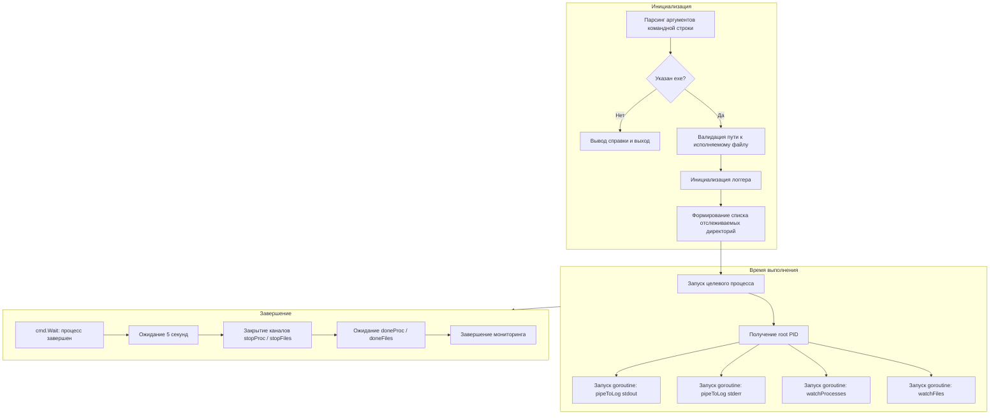
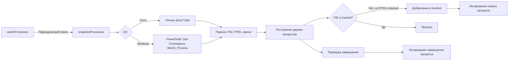
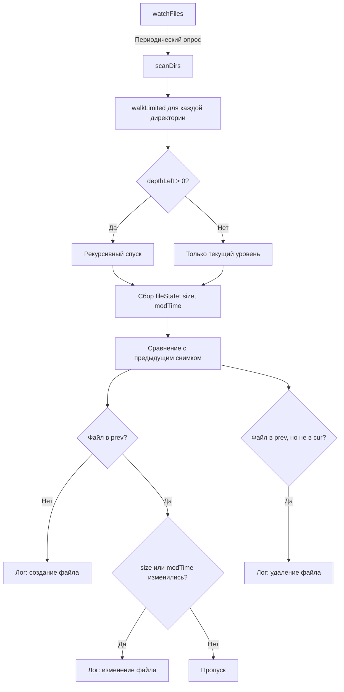
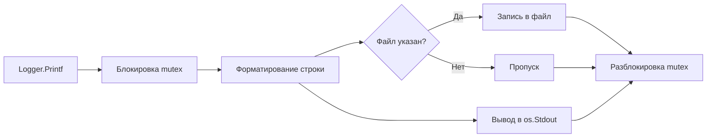

# procwatch

Утилита для мониторинга поведения сторонних исполняемых файлов в средах Windows и Unix. Выполняет запуск целевой программы, отслеживает порождение дочерних процессов и фиксирует изменения в файловой системе в режиме реального времени.

## Возможности

- **Кроссплатформенный мониторинг процессов** — сбор дерева процессов с идентификацией родительских связей через `/proc` (Linux) или WMI/CIM (Windows).
- **Рекурсивное наблюдение за файловой системой** — опрос состояния файлов с настраиваемой глубиной рекурсии и интервалом опроса.
- **Двухканальное логирование** — параллельный вывод в консоль и файл отчета с временными метками.
- **Перехват потоков вывода** — перенаправление stdout и stderr целевого процесса в единый лог.
- **Контролируемое завершение** — корректная остановка наблюдателей после завершения целевого процесса с учетом времени жизни дочерних процессов.

---

## Архитектура и принцип работы

### Общая схема запуска и взаимодействия компонентов



### Модуль сбора снимков процессов



**Алгоритм отслеживания дочерних процессов:**

1. Формируется снимок всех процессов в системе.
2. Выполняется итеративный обход: если родительский процесс (PPID) уже находится в множестве отслеживаемых, дочерний процесс (PID) добавляется в то же множество.
3. Итерации продолжаются до тех пор, пока на очередном проходе не будет обнаружено новых процессов.
4. Для каждого нового PID формируется запись в лог.
5. Если PID присутствовал в предыдущем снимке, но отсутствует в текущем, фиксируется факт завершения процесса.
6. Цикл наблюдения прерывается, когда корневой процесс и все его потомки завершены.

### Модуль наблюдения за файловой системой



**Алгоритм сканирования:**

1. Для каждой директории из списка выполняется рекурсивный обход с ограничением глубины.
2. Собирается карта состояний файлов: абсолютный путь и структура `fileState` (размер, время модификации).
3. Текущий снимок сравнивается с предыдущим:
   - Отсутствующий в `prev`, но присутствующий в `cur` — создание.
   - Присутствующий в обоих с различающимися атрибутами — изменение.
   - Присутствующий в `prev`, но отсутствующий в `cur` — удаление.
4. Текущий снимок становится предыдущим для следующей итерации.

### Модуль логирования



Компонент `Logger` обеспечивает потокобезопасный вывод с единым форматом временной метки `[HH:MM:SS.mmm] [%-8s] сообщение`. Запись в файл и консоль выполняется атомарно под защитой мьютекса.

---

## Установка

Требования: Go 1.18 или новее.

```bash
git clone https://github.com/username/procwatch.git
cd procwatch
go build -o procwatch procwatch.go
```

Для Windows рекомендуется сборка с указанием целевой архитектуры:

```bash
GOOS=windows GOARCH=amd64 go build -o procwatch.exe procwatch.go
```

---

## Использование

```text
procwatch -exe <путь к программе> [-args "аргументы"] [-watch "dir1,dir2"] [-log report.log]
```

### Аргументы командной строки

| Флаг | По умолчанию | Описание |
|------|-------------|----------|
| `-exe` | *обязательный* | Путь к исполняемому файлу, за которым необходимо вести наблюдение |
| `-args` | `""` | Аргументы командной строки для целевой программы (через пробел, кавычки для значений с пробелами) |
| `-watch` | `""` | Дополнительные директории для отслеживания через запятую |
| `-interval` | `700ms` | Интервал опроса процессов и файловой системы |
| `-log` | `""` | Путь к файлу отчета (если не указан — только консоль) |
| `-no-defaults` | `false` | Отключить стандартный набор директорий (temp, appdata и др.) |
| `-depth` | `6` | Максимальная глубина рекурсии при сканировании |

### Стандартный набор отслеживаемых директорий

**Windows:**
- Директория с исполняемым файлом
- `%TEMP%`, `%TMP%`, `%APPDATA%`, `%LOCALAPPDATA%`
- `%ProgramData%`, `%ProgramFiles%`, `%ProgramFiles(x86)%`
- `%USERPROFILE%\Desktop`, `%USERPROFILE%\Start Menu`

**Unix:**
- Директория с исполняемым файлом
- `/tmp` (или аналог через `os.TempDir()`)
- `$HOME`

---

## Примеры

### Базовый запуск

```bash
./procwatch -exe /usr/bin/suspicious_tool -log report.log
```

### Запуск с аргументами и дополнительными директориями

```bash
./procwatch -exe ./malware_sample \
    -args "--config evil.conf --verbose" \
    -watch "/tmp,/var/tmp,$HOME/Downloads" \
    -log analysis.log \
    -depth 4
```

### Только файловая система без стандартных путей

```bash
./procwatch -exe ./target.exe \
    -watch "C:\\Users\\Analyst\\Workspace" \
    -no-defaults \
    -interval 1s \
    -log minimal.log
```

---

## Формат выходных данных

Каждая запись лога имеет единый формат:

```
[14:34:05.123] [INFO    ] Цель: /path/to/exe
[14:34:05.124] [PROCESS ] Запущен основной процесс PID=12345 (exe_name)
[14:34:05.456] [PROCESS ] Создан дочерний процесс PID=12346 PPID=12345 (child_name)
[14:34:06.789] [FILE    ] Создан файл: /tmp/malware_drop.exe (2048 байт)
[14:34:07.012] [FILE    ] Изменён файл: /tmp/config.dat (1024 -> 2048 байт)
[14:34:08.345] [PROCESS ] Процесс PID=12346 завершился
[14:34:10.678] [INFO    ] Программа завершилась успешно (код 0)
```

---
