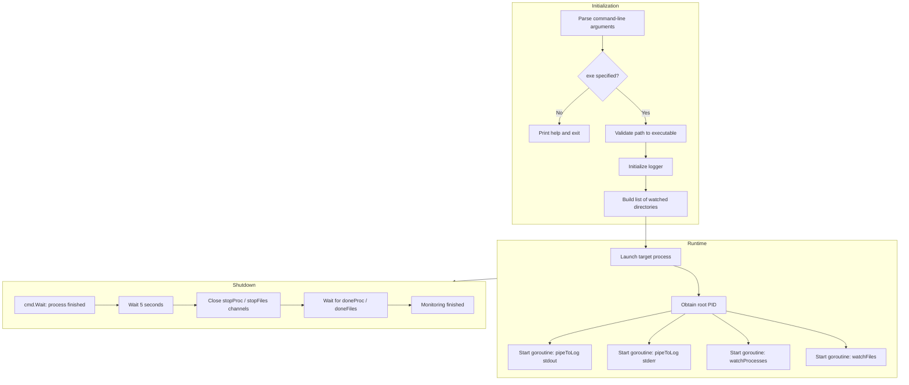
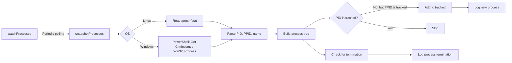
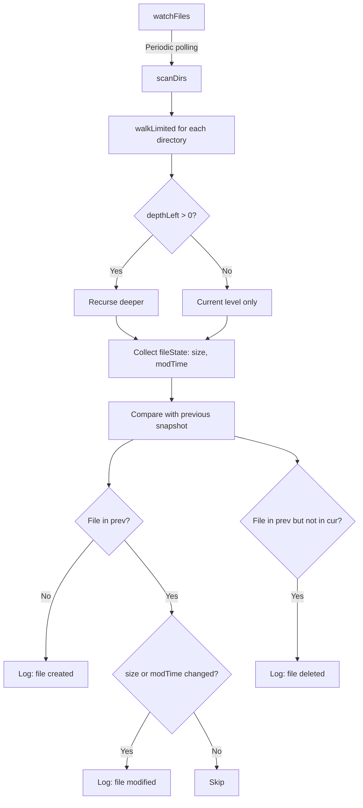
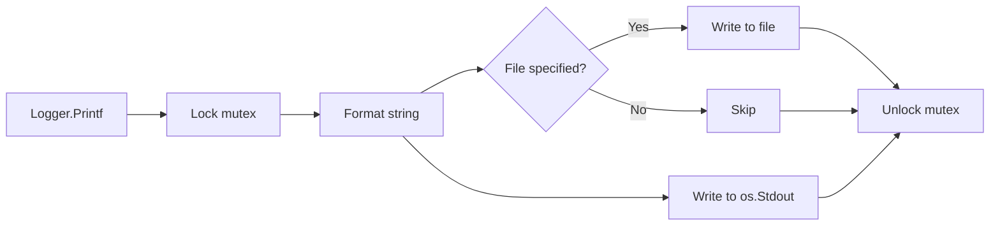

# procwatch

A utility for monitoring the behavior of third-party executable files on Windows and Unix systems. It launches a target program, tracks the spawning of child processes, and records file system changes in real time.

## Features

- **Cross-platform process monitoring** — collects the process tree with parent-child relationship identification via `/proc` (Linux) or WMI/CIM (Windows).
- **Recursive file system watching** — polls file state with configurable recursion depth and polling interval.
- **Dual-channel logging** — simultaneous output to console and to a timestamped report file.
- **Output stream capture** — redirects the target process's stdout and stderr into a unified log.
- **Controlled shutdown** — gracefully stops watchers after the target process finishes, accounting for the lifetime of child processes.

---

## Architecture and How It Works

### Overall launch flow and component interaction



### Process snapshot module



**Child process tracking algorithm:**

1. A snapshot of all processes in the system is taken.
2. An iterative traversal is performed: if a process's parent (PPID) is already in the tracked set, the child process (PID) is added to that same set.
3. Iterations continue until a pass finds no new processes.
4. A log entry is created for each new PID.
5. If a PID was present in the previous snapshot but is missing from the current one, its termination is recorded.
6. The monitoring loop stops once the root process and all of its descendants have terminated.

### File system monitoring module



**Scanning algorithm:**

1. Each directory in the list is recursively walked with a depth limit.
2. A map of file states is collected: absolute path and a `fileState` structure (size, modification time).
3. The current snapshot is compared to the previous one:
   - Absent from `prev` but present in `cur` — creation.
   - Present in both with differing attributes — modification.
   - Present in `prev` but absent from `cur` — deletion.
4. The current snapshot becomes the previous snapshot for the next iteration.

### Logging module



The `Logger` component provides thread-safe output with a single timestamp format `[HH:MM:SS.mmm] [%-8s] message`. Writes to file and console are performed atomically, protected by a mutex.

---

## Installation and Build

Requirements: Go 1.18 or newer.

```bash
git clone https://github.com/phrensied/procwatch.git
cd procwatch\source
go build -o procwatch procwatch.go
```

For Windows, building with an explicit target architecture is recommended:

```bash
GOOS=windows GOARCH=amd64 go build -o procwatch.exe procwatch.go
```

---

## Usage

```text
procwatch -exe <path to program> [-args "arguments"] [-watch "dir1,dir2"] [-log report.log]
```

### Command-line arguments

| Flag | Default | Description |
|------|---------|-------------|
| `-exe` | *required* | Path to the executable file to monitor |
| `-args` | `""` | Command-line arguments for the target program (space-separated, quote values containing spaces) |
| `-watch` | `""` | Additional directories to watch, comma-separated |
| `-interval` | `700ms` | Polling interval for processes and the file system |
| `-log` | `""` | Path to the report file (console only if not specified) |
| `-no-defaults` | `false` | Disable the default set of directories (temp, appdata, etc.) |
| `-depth` | `6` | Maximum recursion depth when scanning |

### Default set of watched directories

**Windows:**
- The directory containing the executable
- `%TEMP%`, `%TMP%`, `%APPDATA%`, `%LOCALAPPDATA%`
- `%ProgramData%`, `%ProgramFiles%`, `%ProgramFiles(x86)%`
- `%USERPROFILE%\Desktop`, `%USERPROFILE%\Start Menu`

**Unix:**
- The directory containing the executable
- `/tmp` (or its equivalent via `os.TempDir()`)
- `$HOME`

---

## Examples

### Basic run

```bash
./procwatch -exe /usr/bin/suspicious_tool -log report.log
```

### Run with arguments and additional directories

```bash
./procwatch -exe ./malware_sample \
    -args "--config evil.conf --verbose" \
    -watch "/tmp,/var/tmp,$HOME/Downloads" \
    -log analysis.log \
    -depth 4
```

### File system only, without default paths

```bash
./procwatch -exe ./target.exe \
    -watch "C:\\Users\\Analyst\\Workspace" \
    -no-defaults \
    -interval 1s \
    -log minimal.log
```

---

## Output Format

Each log entry follows a single format:

```
[14:34:05.123] [INFO    ] Target: /path/to/exe
[14:34:05.124] [PROCESS ] Started main process PID=12345 (exe_name)
[14:34:05.456] [PROCESS ] Created child process PID=12346 PPID=12345 (child_name)
[14:34:06.789] [FILE    ] Created file: /tmp/malware_drop.exe (2048 bytes)
[14:34:07.012] [FILE    ] Modified file: /tmp/config.dat (1024 -> 2048 bytes)
[14:34:08.345] [PROCESS ] Process PID=12346 exited
[14:34:10.678] [INFO    ] Program finished successfully (code 0)
```

---
